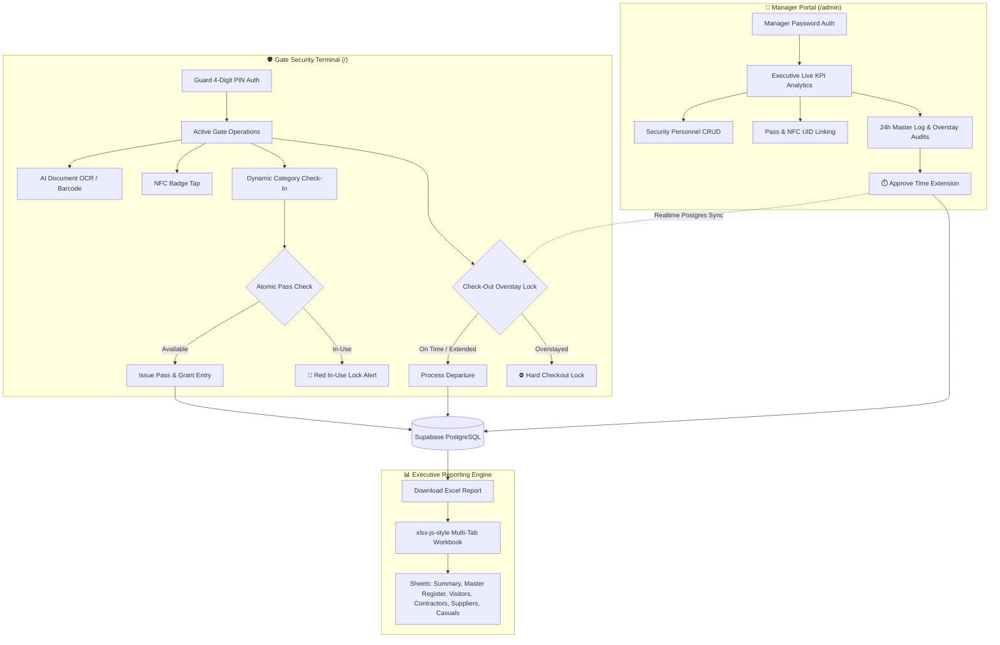

# 🏨 Hotel Security & Visitor Access Management System

[](https://hotel-security-app.vercel.app/)
[](https://react.dev/)
[](https://vitejs.dev/)
[](https://supabase.com/)
[](https://tailwindcss.com/)

A modern, offline-resilient, and multi-role **Hotel Security, Visitor Access & Contractor Permitting Terminal** engineered for luxury hotels, resorts, and gated hospitality facilities.

---

## 🌐 Live URLs

- **🛡️ Guard Security Terminal**: [https://hotel-security-app.vercel.app/](https://hotel-security-app.vercel.app/)
- **👔 Security Manager Portal**: [https://hotel-security-app.vercel.app/admin](https://hotel-security-app.vercel.app/admin)

---

## 🏛️ System Architecture



---

## ✨ Key Features & Capabilities

### 1. 🛡️ Guard Security Terminal (`/`)
- **Fast Security Officer Authentication**: 6-digit PIN (SHA-256 hashed), verified server-side and bound to an authenticated Supabase session; repeated wrong PINs lock the guard out. See [`SECURITY.md`](./SECURITY.md) and the `supabase-c1_5-*` / `supabase-c2-*` migrations.
- **Cloud Document OCR Scanner (OCR.space)**:
  - Live camera viewfinder scanning Emirates IDs and international passports.
  - Automatically parses Full Name, Document Number, Nationality, and Expiry Date.
  - Automatic detection and blocking of **Expired Documents** (`⛔ ACCESS DENIED`).
  - Integrated Barcode / QR Code detector (`ZXing`).
- **Dynamic Category Forms**:
  - **🏨 Visitors**: Host / Manager name, purpose of visit (Meeting, Interview, Custom), and department.
  - **🔨 Contractors & Engineering**: Kind of Work (*Confined Space, Electrical, Work on Height, Hot Work, Landscaping*), **Work Permit Number (PTW #)**, **Area of Work**, and description of work.
  - **🚚 Suppliers & Delivery**: Purpose of Visit dropdown (*Delivery, Meeting, Other*).
  - **🍽️ Casual Staff (Banquet / HK / Stewarding)**: Automated casual duration tracking.
- **Atomic Pass Contention & Double-Issue Prevention**:
  - Visual distinction: **🟢 Available Passes (Slate/Blue)** vs **🔴 Issued Passes (Red `🔒 IN USE`)**.
  - Clicking an in-use pass displays an immediate warning showing who is holding it.
  - Pre-insertion atomic database check prevents race conditions across multiple gates.
- **Strict Overstay Check-out Hard Lock**:
  - Automatically tracks duration against authorized time limits.
  - If a visitor overstays, their check-out button locks into **`🔒 Overstay Lock`** with audio/visual warnings.
  - Guards **cannot** check them out until a security manager approves a time extension in the Manager Portal.
- **NFC Hardware Integration**:
  - Web NFC API (`NDEFReader`) support for tapping badges against NFC-enabled Android devices for instant check-in and return check-out.

---

### 2. 👔 Security Manager Portal (`/admin`)
- **Executive KPI Dashboard**: Live stats on current on-property visitors, total entries, checked-out visitors, overstay incidents, and active time extensions.
- **Time Extension Granting (`⏱️ + Extend`)**:
  - Managers can grant extra hours (`+1h`, `+2h`, `+4h`, `+8h`, or custom decimal hours).
  - Requires mandatory justification reason and manager name.
  - Instantly syncs to the Guard Terminal, unlocking the overstay lock in real time.
- **Pass Inventory Management**: Create, delete, and link physical pass numbers (`V-001`, `C-001`, `S-001`) with NFC tag UIDs.
- **Security Personnel Management**: Register guards, assign active gates, and manage 6-digit PINs.
- **24-Hour Active Shift View**: Synchronized logs table matching the Guard Terminal, with filters for Last 24 Hours, Last 12 Hours, and All Time.

---

### 3. 📊 Professional Multi-Tab Excel Exporter (`.xlsx`)
Engineered with `xlsx-js-style` to match executive hospitality audit spreadsheets:
- **🎨 Custom Styling & Color Scheme**:
  - **Row 1**: Deep Navy Blue Title Banner (`#1F3864`) with bold white text.
  - **Row 2**: Subheader with Light Golden Yellow Date Input Box (`#FFF2CC`).
  - **Row 4**: Deep Navy Column Headers (`#1F3864`) with centered bold text.
  - **Date Separators**: Royal Blue Date Group Banners (`#2F5597`).
  - **Time In / Time Out**: Highlighted in soft mint green (`#F0FDF4`).
  - **Pass Numbers**: Monospaced bold navy text.
  - **Overstay Alerts**: Highlighted in soft red (`#FEE2E2`) with bold red text (`⚠️ OVERSTAYED by +Xh`).
  - **Manager Extensions**: Highlighted in soft cyan (`#ECFEFF`) with extension notes and approving manager.
- **❄️ Freeze Panes**: Rows 1–4 are frozen at the top across all sheets so headers remain fixed when scrolling through hundreds of visitor records.
- **📑 Tab Structure**:
  1. **`Summary`**: Executive KPI cards, category breakdown, grand totals, and department share.
  2. **`Master Register`**: Complete chronological register of all entries across all gates and shifts.
  3. **`Visitors`**: Guest, meeting, and official visitor access logs with **`Allowed Time`**.
  4. **`Contractors`**: Specialized layout with **`Type of Work`**, **`PTW Number`**, **`Area of Work`**, and **`Allowed Duration of Work`**.
  5. **`Suppliers`**: Delivery and vendor access logs.
  6. **`Casuals`**: Banquet, housekeeping, and F&B casual workforce logs.

---

## 🗄️ Database Schema (Supabase PostgreSQL)

### 1. `hotel_security_logs`
| Column | Type | Description |
| :--- | :--- | :--- |
| `id` | `UUID (PK)` | Unique log entry identifier |
| `shift_id` | `UUID` | Security shift session reference |
| `logged_by_guard` | `TEXT` | Security officer who recorded check-in |
| `full_name` | `TEXT` | Visitor / Contractor full legal name |
| `doc_number` | `TEXT` | Emirates ID or Passport number |
| `mobile_number` | `TEXT` | Visitor contact phone number |
| `company_name` | `TEXT` | Organization, vendor, or contractor agency |
| `vehicle_plate` | `TEXT` | Vehicle registration plate or 'Walk-in' |
| `nationality` | `TEXT` | ISO or full nationality name |
| `id_expiry_date` | `DATE` | Document expiry date |
| `traffic_type` | `TEXT` | `hotel_guest_visitor`, `contractor_engineer`, `supplier_delivery`, `casual_staff_banquet` |
| `purpose_of_visit` | `TEXT` | Reason for entry, PTW details, and extension audit notes |
| `host_room_or_dept`| `TEXT` | Destination department, area of work, and host person |
| `pass_badge_no` | `TEXT` | Physical badge assigned (`V-001`, `C-002`, `CASUAL`) |
| `allowed_hours` | `NUMERIC`| Authorized stay duration in hours (e.g. `2`, `0.5`, `6`) |
| `check_in_time` | `TIMESTAMPTZ`| Timestamp of arrival |
| `check_out_time` | `TIMESTAMPTZ`| Timestamp of departure |
| `checkout_by_guard`| `TEXT` | Security officer who recorded check-out |
| `status` | `TEXT` | Current status (`inside` or `checked_out`) |

### 2. `guards`
| Column | Type | Description |
| :--- | :--- | :--- |
| `id` | `UUID (PK)` | Guard record identifier |
| `name` | `TEXT` | Security officer name |
| `pin_hash` | `TEXT` | SHA-256 hashed 6-digit PIN |
| `is_active` | `BOOLEAN` | Account status flag |

### 3. `passes`
| Column | Type | Description |
| :--- | :--- | :--- |
| `id` | `UUID (PK)` | Pass identifier |
| `pass_number` | `TEXT` | Badge identifier (e.g. `V-001`, `C-001`) |
| `pass_type` | `TEXT` | Category (`visitor`, `contractor`, `supplier`) |
| `status` | `TEXT` | Availability status (`available` or `in_use`) |
| `nfc_uid` | `TEXT` | Physical NFC chip serial number |

---

## ⚡ Supabase Edge Functions

- **`scan-id` (`supabase/functions/scan-id/index.ts`)**:
  - OCR parsing proxy (**OCR.space**) for Emirates ID (front & back TD1 format) and International Passports (ICAO 9303 TD3 MRZ).
  - CORS restricted to an `ALLOWED_ORIGINS` allowlist; deploy **without** `--no-verify-jwt` so only signed-in callers can invoke it. Configure with `npx supabase secrets set OCR_SPACE_API_KEY=…`.

---

## 🚀 Local Development Setup

### 1. Prerequisites
- **Node.js**: v18.0 or higher
- **npm**: v9.0 or higher

### 2. Clone and Install Dependencies
```bash
git clone https://github.com/Singh-smart-solutions/hotel-security-app.git
cd hotel-security-app
npm install
```

### 3. Environment Configuration
Create a `.env` file in the root directory:
```env
VITE_SUPABASE_URL=https://wolwwrxhpbvhbtciuizw.supabase.co
VITE_SUPABASE_ANON_KEY=eyJhbGciOiJIUzI1NiIsInR5cCI6IkpXVCJ9...
```

### 4. Run Locally
```bash
npm run dev
```
Open [http://localhost:5173](http://localhost:5173) in your browser.

### 5. Build for Production
```bash
npm run build
```

---

## 🧪 Security & Concurrency Stress Testing

A standalone concurrency simulation test suite is included in [`stress_test_simulation.mjs`](./stress_test_simulation.mjs):
```bash
node stress_test_simulation.mjs
```
**Tests Covered**:
- Multi-Guard PIN SHA-256 validation.
- Row-Level Security (RLS) enforcement.
- Concurrent pass issuance race condition interception.
- Overstay hard-lock detection and manager extension unlocking.
- 24-hour active window query accuracy.

---

## 📄 License & Maintainer

- **Organization**: Singh Smart Solutions
- **Repository**: [https://github.com/Singh-smart-solutions/hotel-security-app](https://github.com/Singh-smart-solutions/hotel-security-app)
- **Deployment**: Vercel (Auto-deploy on `main` branch push)
